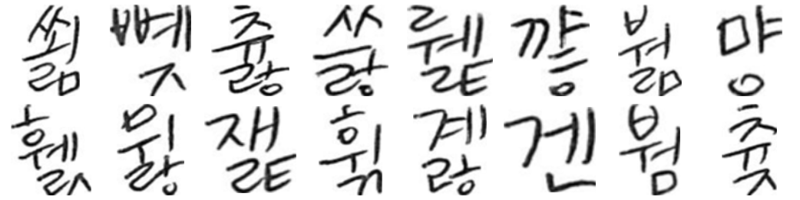

# FontGAN
2021-2 Applications and practice in neural networks [Project 1]

## Pretraining results
Dice score: 0.9836
### Inference

### Ground truth

## Training results
Dice score: 0.9841
### Inference

### Ground truth
